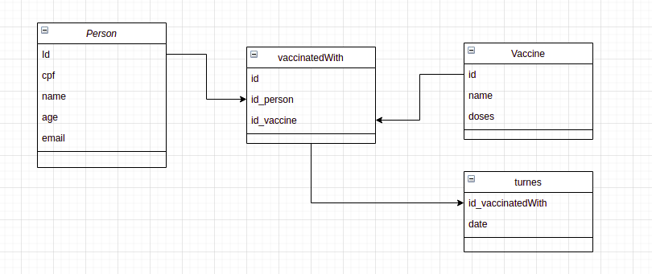

<h1 align="center"> Vacinação API </h1>	

  <h3> Por que? 🤔 </h3>
  

 	  Precisamos gerenciar vacinação contra COVID no reino de Tão Tão Distante.
  

  <h3> Requisitos - versão 1.0 📒 </h3>
  

 	  <ul>
        <li> Cadastrar as pessoas do reino. </li>
        <li> Cadastrar as vacinas disponiveis. </li>
        <li> Registrar as pessoas que tomaram vacinas. </li>
        <li> Caso a vacina tomada tenha mais de uma dose, não permitir que o   cidadão tome antes do tempo determinado para a segunda dose. </li>
    </ul>
  

 <h3> Modelo Entidade Relacionamento 🔍 </h3>
  
 

 <h3> Objetivo </h3>
 

     Criar uma API Rest usando TDD com alguns conceitos de arquitetura limpa e padroões de projeto
     no curso <a href="https://www.udemy.com/course/tdd-com-mango/ "> NodeJs, Typescript, TDD, DDD, Clean Architecture e SOLID </a>.
 

 <h3> Gostou? 🍩 </h3>
 

     Então larga um estrelinha nesse projeto 😊
     (lá em cima do lado esquerdo). 
 

